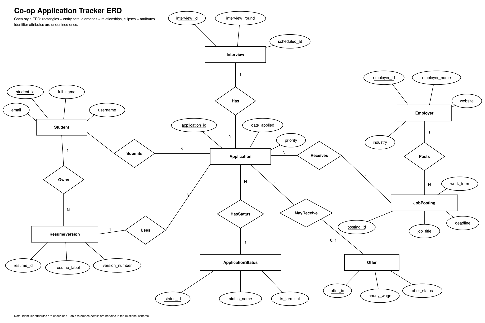

# ERD

## Rendered Diagram

## Conceptual Design

The main idea is to describe what should be in the database before thinking too much about screens or code. For this project, the important things are students, employers, job postings, applications, statuses, resume versions, interviews, and offers.

We chose these entity sets because each one has its own information and its own identifier. For example, an employer has a name and website, while a job posting has a title, deadline, and work term. We think those should be separate because one employer can have many postings.

The Er diagram follows the same general style as the lecture slides: entity sets are rectangles, attributes are ellipses, relationships are diamonds, and identifier attributes are underlined. Table reference details are handled later in the relational schema instead of being treated as ERD attributes.

## Entity Sets And Identifiers

| Entity Set | Identifier | Notes |
| --- | --- | --- |
| Student | `student_id` | A student using the tracker |
| Employer | `employer_id` | A company or organization |
| JobPosting | `posting_id` | A job posted by an employer |
| ApplicationStatus | `status_id` | Lookup table for statuses |
| ResumeVersion | `resume_id` | A resume version owned by a student |
| Application | `application_id` | A student's application to a posting |
| Interview | `interview_id` | One interview round for an application |
| Offer | `offer_id` | An offer for an application |

## Main Relationships And Multiplicities

- One employer can create many job postings.
- Each job posting belongs to exactly one employer.
- One student can have many resume versions.
- One student can submit many applications.
- One job posting can have many applications.
- Each application belongs to one student and one job posting.
- Each application has one current status.
- One application can have many interviews.
- One application can have zero or one offer in this first design.
